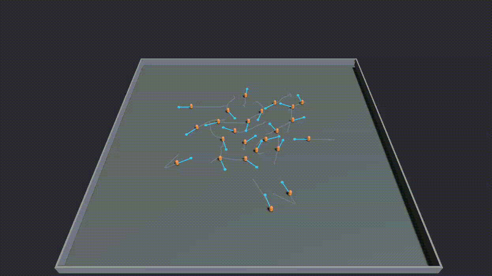

# swarm

A playground for agentic swarms: a small 3D physics world that external
agent processes connect to and drive vehicles around. Built in Rust with
[Bevy](https://bevyengine.org) (ECS) and [Rapier](https://rapier.rs)
(physics). The **simulation runs headless** and streams the world to
separate **viewer** processes — so you can watch it in a 3D window, run it on
a server with no display, or attach several viewers at once.

It's a dev toy — an evolving sandbox for experimenting with how independent
agents (scripted or LLM-driven) behave in a shared physical space, not a
finished product.

## The idea

An agent controls its vehicle through two layers:

- **Plan** (slow, deliberative) — a path of waypoints, each with a target
  speed. "Drive here, then here." The server follows it.
- **Reflexes** (fast, reactive) — declarative rules like *"if
  time-to-collision < 2s, brake"*, evaluated on the server every physics
  tick. They override the plan the instant they fire, so a vehicle reacts
  in one tick regardless of how slow its controlling agent is to think.

The world runs as a **scenario**: a fixed roster of vehicles declared up
front. The simulation waits for every declared agent to connect, runs, and
ends if any of them drops (after a short reconnect grace window).

Agents are external processes speaking **WebSocket + JSON**, so you can
write one in any language. Viewers are a separate pathway: the sim streams
semantic scene state (MessagePack) that any viewer renders however it likes.

## Quick start

Needs a recent Rust toolchain (pinned in `rust-toolchain.toml`) and, on
Linux, the usual windowing/audio dev libraries Bevy requires (for the
viewer). The one-command launcher starts the whole stack:

```sh
scripts/run.sh                 # headless sim + viewer + demo agents
```

Or run the pieces yourself:

```sh
# The headless simulation (no window). Binds :4000 for agents, :4001 for viz.
cargo run --bin server -- scenario.json

# The viewer — opens the 3D window and renders the stream. Start it any
# time; it reconnects on its own.
cargo run --bin viewer

# Drive two vehicles (needs `pip install websockets`).
python3 clients/python/patrol_demo.py
```

You'll see two vehicles circle the arena, each trailing its recent path and
showing the waypoints ahead of it. `scenario.json` defines the arena size
and the roster.

### A swarm avoiding itself

For something busier, run dozens of agents that all cross the arena at once
and steer around one another:

```sh
scripts/run.sh scenario_swarm.json clients/python/swarm_avoidance.py
```



Each agent orbits between a point on a big circle and its antipode, so they
all converge on the center together. The avoidance is the agents' own work,
not the sim's: reflexes can only brake (a safety net), so the actual
steering comes from each agent re-planning every tick against its neighbors
— boids-style separation plus a swirl bias to break head-on deadlocks. This
is the intended split — agents are the brains; the sim follows plans and
enforces reflexes. `--generate N` rewrites the scenario for a different
agent count:

```sh
python3 clients/python/swarm_avoidance.py --generate 36
```

## Writing an agent

An agent connects to `ws://<host>:4000` and exchanges JSON. The essentials:

```jsonc
// -> join the scenario under a declared roster name
{ "type": "join", "name": "car-1" }

// -> a plan: a path of waypoints (position + target speed)
{ "type": "submit_plan", "waypoints": [
    { "position": { "x": 15, "y": 0, "z": 0 }, "speed": 5 }
] }

// -> reflex rules, evaluated server-side every tick
{ "type": "register_reflexes", "rules": [
    { "sensor": { "kind": "time_to_collision" }, "operator": "less_than",
      "threshold": 2.0, "action": "brake", "priority": 10 }
] }

// -> ask for a world snapshot whenever you want to (re)plan
{ "type": "get_state" }
```

The server pushes back `joined`, `state` snapshots, `reflex_fired` events
(when a reflex overrides your plan), `scenario_ended`, and `error`. The
exact shapes live in [`crates/protocol`](crates/protocol/). Working clients:
[`agent_smoke.py`](clients/python/agent_smoke.py) (minimal),
[`swarm_avoidance.py`](clients/python/swarm_avoidance.py) (re-plans every
tick against neighbors), and the Rust
[`rust_agent`](crates/server/examples/rust_agent.rs) example.

## Layout

A Cargo workspace of seven crates, each owning one concern:

```
protocol  ── agent wire types (JSON messages) + scenario schema
movement  ── how a vehicle moves: the MovementModel trait + Holonomic/CarLike
sensors   ── the reflex layer: sensors + rule evaluation
transport ── the async agent WebSocket server, bridged into the sync loop
viz       ── the visualization pathway: scene wire types + broadcast server
server    ── the headless simulation binary that wires it all together
viewer    ── the reference 3D visualizer that renders the viz stream
```

Two independent pathways meet at the `server`: agents talk over `transport`
(control), viewers subscribe over `viz` (observation). The library crates
have READMEs and runnable examples under `crates/<name>/examples/` (e.g.
`cargo run -p sensors --example reflex_brake`).

## Development

```sh
cargo fmt --all --check
cargo clippy --workspace --all-targets -- -D warnings
cargo test --workspace
```

Conventions, architecture notes, and the correctness guardrails that aren't
obvious from the code are in [CLAUDE.md](CLAUDE.md). This repository uses
Test-Driven Development.

## Status

Ships two movement models — `Holonomic` (moves freely in any direction)
and `CarLike` (forward-only thrust, bounded turn rate, lateral grip) —
selected per agent via the roster's `embodiment` field
(`scenario_carlike.json` runs an all-car-like scenario). Plus ground-truth
sensors and a walled arena. The movement and sensor layers are extension
points: `FullVehicle` physics and simulated sensors (noise, limited range,
latency) are intended future work behind the same interfaces.
